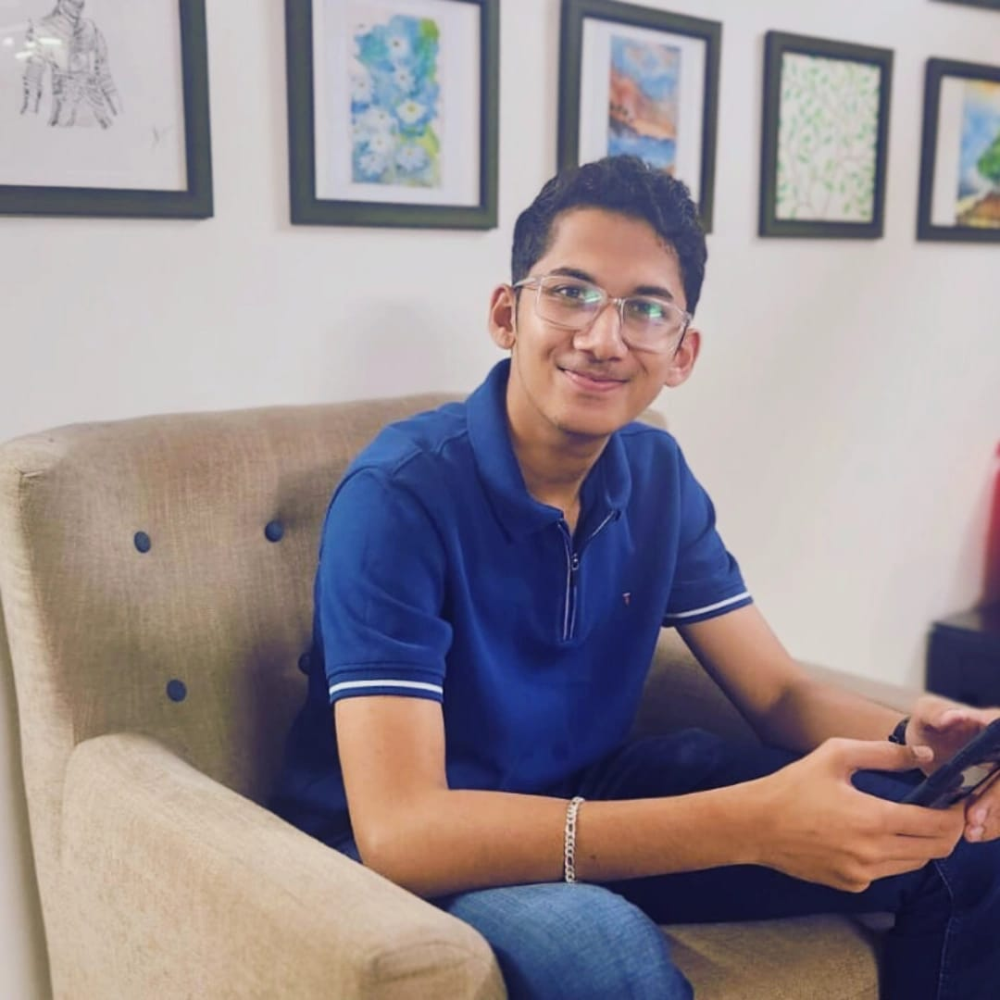

# Name

<h3>Sameer Patwardhan</h3> 

 

# Job Role <!--(Where I see myself in Future)-->
Robotic Analyst and Enthusiast

# Education
**B.Tech**  
**Automation and Robotics Engineering**  
2024 - 2028  
JSPM's Rajarshi Shahu College of Engineering

# About
"Turning ideas into reality by blending Design, Programming, and AI. Skilled in **Fusion 360**, Prompt Engineering, and Mechanical Assembly. As a **Mechanical Team Member** at **Team CiPHER**, I contribute to **CAD design**, **analysis**, and prototyping. Passionate about integrating AI/ML with mechanical and software systems to build innovative, high-performance solutions."

# Experience
<b><u>Mechanical Team Member [Design and Analysis]</u></b>  
<b><i>@ Team CiPHER</i></b>  
<i>April 2025 - Present</i>  
-Focused on designing and analyzing mechanical assemblies using CAD Software: Autodesk Fusion 360

-High passion for mechanical design drove to create innovative solutions that improved project outcomes.

-Used PDE ToolBox of MATLAB for Finite Element Analysis of the projects

-Collaborated closely with team members to ensure high-quality results and fostered a culture of creativity and efficiency.

# Skills
<ul>
<li>Autodesk Fusion 360</li><a href="">View Certificate</a>
<li>Product Design</li><a href="">View Certificate</a>
<li>Finite Element Analysis</li>
<li>Prompt Engineering</li><a href="Prompt Engineering.pdf">View Certificate</a>
</ul>

## Contact Me

